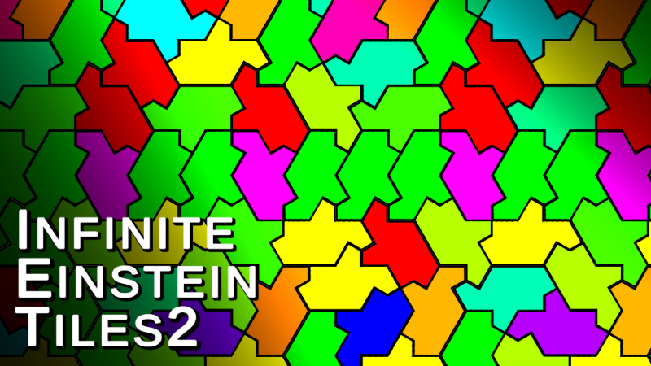

# Infinite Einstein Tiles
This is the source code for Infinite Einstein Tiles2!

## Building
Infinite Einsten Tiles is a game made in unity. Clone the repository and import it into unity; there are many detailed instructions on the web on how to run this in unity, so I won't go into them here.

If you are unable to do so, please consider purchasing on [Steam](https://store.steampowered.com/app/3550470/Infinite_Einstein_Tiles/).

### Unity Version
- 6000.0.35f1

## Contributing
This repository is entirely community-operated. This means you can help by submitting bug reports, reviewing other people's code, contributing your own code, and so on.

Read [CONTRIBUTING.md](./CONTRIBUTING.md) for more information.

## License
Unless otherwise noted, the code in this repository is licensed under `Apache-2.0`. Read [LICENSE](./LICENSE) for the full license.
